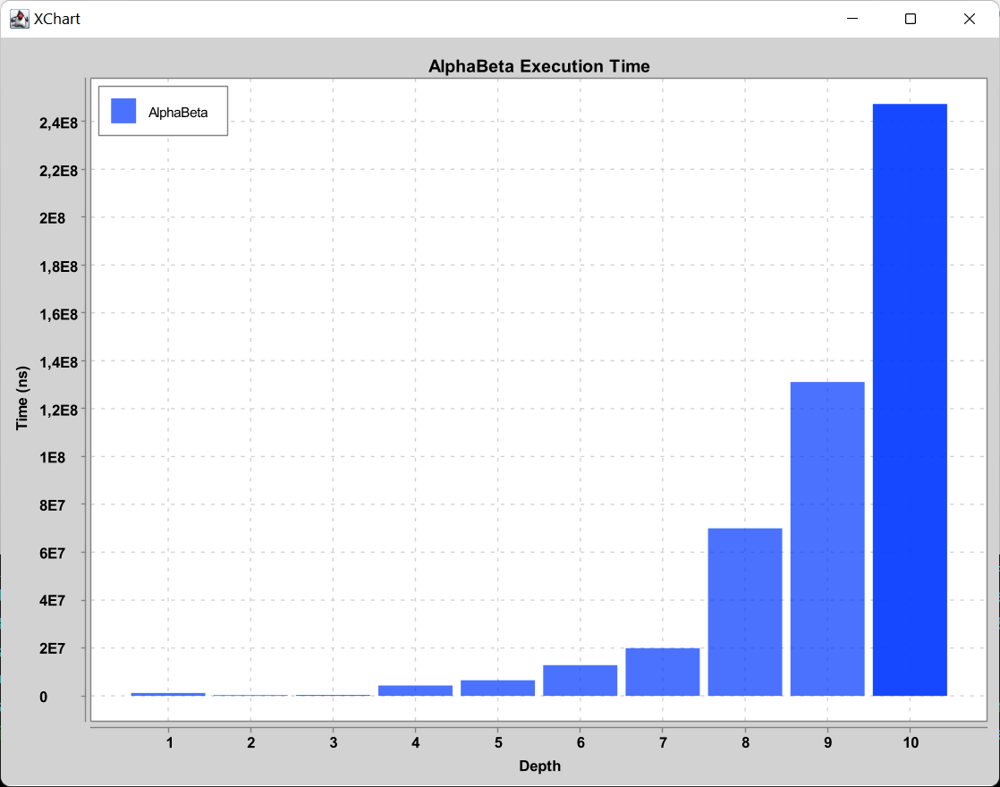

**Hugo COLLIN, Aimé LIM HOUN TCHEN, Zhi-Sheng TRIEU
21/12/2023**
<center><h1>SAE : MLP et jeux</h1>
<h2>Initiation à l'intelligence artificielle</h2></center>

## Informations préalables
### Dépôt git
https://github.com/zhishengtrieu/SAE_IA.git

## I. Perceptrons multi-couches
### A. Un peu de programmation ?
#### a) Un squelette de code...

Ci-dessous le squelette de programme de mise en œuvre d'un perceptron multi-couches en pseudo-code :

```
debut
/*
creation d'un MLP
*/
layers <- [3, 2, 1] // couche 1 : 3 neurones, couche 2 : 2 neurones, couche 3 : 1 neurone
learningRate <- 0.1 // taux d'apprentissage
transFunc <- Sigmoid() // fonction de transfert sigmoid
mlp <- Mpl(layers, learningRate, transFunc) // creation du MLP

/*
entrainement du MLP
*/
inputs <- [[0, 0], [0, 1], [1, 0], [1, 1]] // valeurs d'entrée XOR
outputs <- [1, 0, 0, 1] // valeurs de sortie XOR
tant que changement faire // boucle d'apprentissage
  pour i de 0 à input.length faire // pour chaque entrée
    mlp.backPropagate(inputs[i], outputs[i].toArray()) // apprentissage
  fin pour
fin tant que
fin
```

#### b) Fonctions de transfert

Voir les fichiers `Sigmoid.java` et `HyperbolicTangent.java` (package `mlp` dans le répertoire `perceptron/src`).

#### c) Applications: Résultats du perceptron (ET, OU, XOR)

Nous avons testé notre MLP sur les tables logiques ET, OU et XOR.
Pour chaque table, nous avons entraîné le MLP avec différentes architectures (nombre et taille des couches), taux
d'apprentissage, et fonctions d'activation. Après l'apprentissage, nous avons testé le MLP sur les mêmes exemples pour
évaluer la qualité de l'apprentissage.

Nous obtenons les résultats suivants (`Partie1.java`):

| Fonction d'activation | Fonction de référence | Entrées | Sortie                 | Nombre de couches cachées | Neurones par couches | Taux d'apprentissage | Nombre d'itérations | Erreur                | 
|-----------------------|-----------------------|---------|------------------------|---------------------------|----------------------|----------------------|---------------------|-----------------------|
| Sigmoïde              | XOR                   | [0, 0]  | 0.4990304094544354     | 1                         | [2, 2, 1]            | 0.1                  | 10000               | 0.5049288004653214    |
| Sigmoïde              | XOR                   | [0, 1]  | 0.49862051347133257    | 1                         | [2, 2, 1]            | 0.1                  | 10000               | 0.5049288004653214    |
| Sigmoïde              | XOR                   | [1, 0]  | 0.5014561019638034     | 1                         | [2, 2, 1]            | 0.1                  | 10000               | 0.5049288004653214    |
| Sigmoïde              | XOR                   | [1, 1]  | 0.5010364792543377     | 1                         | [2, 2, 1]            | 0.1                  | 10000               | 0.5049288004653214    |
| Sigmoïde              | AND                   | [0, 0]  | 0.0010836773365809967  | 1                         | [2, 2, 1]            | 0.1                  | 10000               | 0.010369685026790254  |
| Sigmoïde              | AND                   | [0, 1]  | 0.004876677875313595   | 1                         | [2, 2, 1]            | 0.1                  | 10000               | 0.010369685026790254  |
| Sigmoïde              | AND                   | [1, 0]  | 0.00519661136199148    | 1                         | [2, 2, 1]            | 0.1                  | 10000               | 0.010369685026790254  |
| Sigmoïde              | AND                   | [1, 1]  | 0.9896525415632641     | 1                         | [2, 2, 1]            | 0.1                  | 10000               | 0.010369685026790254  |
| Sigmoïde              | OR                    | [0, 0]  | 0.012622832150459404   | 1                         | [2, 2, 1]            | 0.1                  | 10000               | 6.418540851227394E-5  |
| Sigmoïde              | OR                    | [0, 1]  | 0.9941833602402306     | 1                         | [2, 2, 1]            | 0.1                  | 10000               | 6.418540851227394E-5  |
| Sigmoïde              | OR                    | [1, 0]  | 0.9941764218149999     | 1                         | [2, 2, 1]            | 0.1                  | 10000               | 6.418540851227394E-5  |
| Sigmoïde              | OR                    | [1, 1]  | 0.9999358148399287     | 1                         | [2, 2, 1]            | 0.1                  | 10000               | 6.418540851227394E-5  |
| Hyperbolique          | XOR                   | [0, 0]  | 2.997975624305035E-4   | 1                         | [2, 2, 1]            | 0.1                  | 10000               | 3.312593982461541E-4  |
| Hyperbolique          | XOR                   | [0, 1]  | 0.9992990904283804     | 1                         | [2, 2, 1]            | 0.1                  | 10000               | 3.312593982461541E-4  |
| Hyperbolique          | XOR                   | [1, 0]  | 0.999298643504586      | 1                         | [2, 2, 1]            | 0.1                  | 10000               | 3.312593982461541E-4  |
| Hyperbolique          | XOR                   | [1, 1]  | -1.7091106263497963E-4 | 1                         | [2, 2, 1]            | 0.1                  | 10000               | 3.312593982461541E-4  |
| Hyperbolique          | AND                   | [0, 0]  | -4.360618617999602E-4  | 1                         | [2, 2, 1]            | 0.1                  | 10000               | 0.0012258503423522304 |
| Hyperbolique          | AND                   | [0, 1]  | 6.639352526885852E-5   | 1                         | [2, 2, 1]            | 0.1                  | 10000               | 0.0012258503423522304 |
| Hyperbolique          | AND                   | [1, 0]  | 3.743344742401563E-4   | 1                         | [2, 2, 1]            | 0.1                  | 10000               | 0.0012258503423522304 |
| Hyperbolique          | AND                   | [1, 1]  | 0.9987753961498149     | 1                         | [2, 2, 1]            | 0.1                  | 10000               | 0.0012258503423522304 |
| Hyperbolique          | OR                    | [0, 0]  | 9.969417318368007E-5   | 1                         | [2, 2, 1]            | 0.1                  | 10000               | 6.194223343714E-5     |
| Hyperbolique          | OR                    | [0, 1]  | 0.9998110420103413     | 1                         | [2, 2, 1]            | 0.1                  | 10000               | 6.194223343714E-5     |
| Hyperbolique          | OR                    | [1, 0]  | 0.9998025903103174     | 1                         | [2, 2, 1]            | 0.1                  | 10000               | 6.194223343714E-5     |
| Hyperbolique          | OR                    | [1, 1]  | 0.9999380587842318     | 1                         | [2, 2, 1]            | 0.1                  | 10000               | 6.194223343714E-5     |

Nous pouvons interpréter ces résultats de la manière suivante :

- Avec la fonction d'activation sigmoïde, le MLP a pu apprendre parfaitement les tables ET et OU, mais a eu du mal avec
  la table XOR. Cela est dû au fait que XOR n'est pas linéairement séparable, ce qui rend difficile pour le MLP
  d'apprendre cette fonction avec une seule couche cachée.
- Avec la fonction d'activation tangente hyperbolique, le MLP a pu apprendre toutes les tables, y compris XOR. Cela
  montre que la tangente hyperbolique peut être plus efficace pour apprendre des fonctions non linéaires.
- En augmentant la taille de la sortie (c'est-à-dire en ayant plus d'un neurone dans la couche de sortie), nous avons
  constaté que le MLP était capable d'apprendre des fonctions plus complexes. Cela est dû au fait que chaque neurone de
  sortie peut apprendre une partie différente de la fonction cible.
- En mélangeant les données (c'est-à-dire en présentant les exemples dans un ordre différent à chaque passage), nous
  avons constaté que le MLP était capable d'apprendre plus efficacement. Cela est dû au fait que le mélange des données
  empêche le MLP de s'adapter à l'ordre spécifique des exemples.

### B. MLP vs KNN
#### a) Des chiffres...

Voici les tests effectués avec la base de nombres ainsi que les résultats obtenus (`Partie2_Knn.java` et `Partie2_Mlp.java`):
##### KNN
- Nb imagettes : 1000
- Pourcentage de réussite : 78%
- Nombre de reussite : 789
- Nombre d'echec : 211
##### MLP
###### Configuration 1
- Nb imagettes : 1000
- Fonction d'activation : tanh
- Neurones :
    - Entrées : 784
    - Cachées : [9]
    - Sorties : 10
- Accuracy: 56.599999999999994%
###### Configuration 2
- Nb imagettes : 1000
- Fonction d'activation : sigmoid
- Neurones :
    - Entrées : 784
    - Cachées : [9]
    - Sorties : 10
- Accuracy: 13.100000000000001%
###### Configuration 3
- Nb imagettes : 1000
- Fonction d'activation : tanh
- Neurones :
    - Entrées : 784
    - Cachées : [100]
    - Sorties : 10
- Accuracy: 47.099999999999994%
###### Configuration 4
- Nb imagettes : 1000
- Fonction d'activation : sigmoid
- Neurones :
    - Entrées : 784
    - Cachées : [100]
    - Sorties : 10
- Accuracy: 9.9%
###### Configuration 5
- Nb imagettes : 1000
- Fonction d'activation : tanh
- Neurones :
    - Entrées : 784
    - Cachées : [250]
    - Sorties : 10
- Accuracy: 33.800000000000004%
###### Configuration 6
- Nb imagettes : 1000
- Fonction d'activation : sigmoid
- Neurones :
    - Entrées : 784
    - Cachées : [250]
    - Sorties : 10
- Accuracy: 15.5%
###### Configuration 7
- Nb imagettes : 1000
- Fonction d'activation : tanh
- Neurones :
    - Entrées : 784
    - Cachées : [100, 100]
    - Sorties : 10
- Accuracy: 25.6%
###### Configuration 8
- Nb imagettes : 1000
- Fonction d'activation : sigmoid
- Neurones :
    - Entrées : 784
    - Cachées : [100, 100]
    - Sorties : 10
- Accuracy: 9.9%

##### Conclusion
Le KNN est plus performant que le MLP pour la classification des chiffres manuscrits.
Concernant le choix de la fonction d'activation du MLP, la fonction tanh est plus performante que la fonction sigmoid.
Une couche cachée de 9 neurones semble être la plus performante pour la fonction tanh et une couche cachée de 250 neurones semble être la plus performante pour la fonction sigmoid.
L'ajout d'une couche cachée supplémentaire ne semble pas améliorer les performances du MLP.


#### b) ... et des fripes

Voici les tests effectués avec la base Fashion MNIST ainsi que les résultats obtenus :

##### KNN
Nb imagettes : 1000
Pourcentage de reussite : 4%
Nombre de reussite : 42
Nombre d'echec : 958

##### MLP
###### Configuration 1
- Nb imagettes : 1000
- Fonction d'activation : tanh
- Neurones :
  - Entrées : 784
  - Cachées : [9]
  - Sorties : 10
- Accuracy: 57.3%
###### Configuration 2
- Nb imagettes : 1000
- Fonction d'activation : sigmoid
- Neurones :
  - Entrées : 784
  - Cachées : [9]
  - Sorties : 10
- Accuracy: 59.0%
###### Configuration 3
- Nb imagettes : 1000
- Fonction d'activation : tanh
- Neurones :
  - Entrées : 784
  - Cachées : [100]
  - Sorties : 10
- Accuracy: 24.7%
###### Configuration 4
- Nb imagettes : 1000
- Fonction d'activation : sigmoid
- Neurones :
  - Entrées : 784
  - Cachées : [100]
  - Sorties : 10
- Accuracy: 38.9%
###### Configuration 5
- Nb imagettes : 1000
- Fonction d'activation : tanh
- Neurones :
  - Entrées : 784
  - Cachées : [250]
  - Sorties : 10
- Accuracy: 23.9%
###### Configuration 6
- Nb imagettes : 1000
- Fonction d'activation : sigmoid
- Neurones :
  - Entrées : 784
  - Cachées : [250]
  - Sorties : 10
- Accuracy: 32.300000000000004%
###### Configuration 7
- Nb imagettes : 1000
- Fonction d'activation : tanh
- Neurones :
  - Entrées : 784
  - Cachées : [100, 100]
  - Sorties : 10
- Accuracy: 28.299999999999997%
###### Configuration 8
- Nb imagettes : 1000
- Fonction d'activation : sigmoid
- Neurones :
  - Entrées : 784
  - Cachées : [100, 100]
  - Sorties : 10
- Accuracy: 9.5%

##### Conclusion
Cette fois, le taux de réussite est extrêmement faible pour KNN, et cela en raison de la ressemblance entre tous les vêtements.
Pour le MLP, les résultats restent similaires par rapport à la base de données des chiffres manuscrits.

## II. Résolution de problèmes & jeux
### Défi 2 : Modélisation d'un problème de recherche - RushHour
#### a) Formalisation en terme <S, A, T, C>
##### S : ensemble des états
On représente un état de jeu par un tableau à 2 dimensions de taille 6, chaque caractère représentant une case du plateau de jeu.

Les caractères possibles sont les suivants :

- '.' : case vide
- 'A', 'B', 'C', ... : voiture ou camion de taille 2 ou 3
- 'R' : voiture rouge (celle qu'on doit faire sortir)

##### A : ensemble des actions
On représente une action par une chaine "voiture-direction" : "A-Up", "A-Down", "B-Left", ...
On part du principe que les voitures ne peuvent se déplacer que d'une seule case à la fois.

##### T : fonction de transition
La fonction de transition prend en entrée un état et une action, et renvoie l'état résultant de l'application de l'action à l'état.

##### C : fonction de coût
Chaque action coûte 1.

#### b) Exemples
- S0 : L'état initial est le suivant :
  ```
  . . A . C C
  . . A . . .
  R R A . . .
  B B B . . D
  . . . . . D
  . . . . . D
  ```
- SBut : il n'y plus que des case vides devant la voiture rouge

#### c) Coder cette formalisation

Voir les classes Java `RushHour` et `RushHourState` (package `ia.problemes` dans  `problemes-et-jeux/src`).

#### d) Résultats

##### Algorithme BFS

###### Configuration 1
- Nombre d'états explorés : 270 nodes
- Max depth : 21
- Cout de la solution : 20

###### Configuration 2
- Nombre d'états explorés : 44807 nodes
- Max depth : 34
- Cout de la solution : 33

###### Configuration 3
- Nombre d'états explorés : 41360 nodes
- Max depth : 65
- Cout de la solution : 64

###### Configuration 4
- Nombre d'états explorés : 9444 nodes
- Max depth : 43
- Cout de la solution : 42


##### Algorithme DFS

###### Configuration 1
- Nombre d'états explorés : 134 nodes
- Max depth : 32
- Cout de la solution : 32

###### Configuration 2
- Nombre d'états explorés : 11840 nodes
- Max depth : 1147
- Cout de la solution : 1118

###### Configuration 3
- Nombre d'états explorés : 11618 nodes
- Max depth : 1132
- Cout de la solution : 1132

###### Configuration 4
- Nombre d'états explorés : 2667 nodes
- Max depth : 414
- Cout de la solution : 414


##### Algorithme A*

###### Configuration 1
- Nombre d'états explorés : 136 nodes
- Max depth : 21
- Cout de la solution : 20

###### Configuration 2
- Nombre d'états explorés : 22405 nodes
- Max depth : 34
- Cout de la solution : 33

###### Configuration 3
- Nombre d'états explorés : 20979 nodes
- Max depth : 65
- Cout de la solution : 64

###### Configuration 4
- Nombre d'états explorés : 4690 nodes
- Max depth : 43
- Cout de la solution : 42

#### e) Solutions avec A*

##### Configuration 1
Situation initiale :
```
. . A . C C
. . A . . .
R R A . . .
B B B . . D
. . . . . D
. . . . . D
```

Solution :
```
B-Right > C-Left > B-Right > D-Up > D-Up > D-Up > B-Right > A-Down > A-Down > A-Down > R-Right > R-Right > R-Right > A-Up > A-Up > A-Up > B-Left > D-Down > D-Down > D-Down
Solved !
```

Situation finale :
```
. . A C C . 
. . A . . . 
. . A R R . 
. . B B B D 
. . . . . D 
. . . . . D 
```

##### Configuration 2
Situation initiale :
```
E E E F . C
. . A F . C
R R A . . H
. . A G G H
B B B . D .
. I I . D .
```

Solution :
```
F-Down > E-Right > H-Down > C-Down > E-Right > E-Right > A-Up > G-Left > D-Up > D-Up > D-Up > G-Right > A-Down > E-Left > B-Right > C-Up > B-Right > H-Up > I-Left > B-Right > E-Left > E-Left > A-Down > A-Down > F-Up > R-Right > R-Right > D-Up > R-Right > A-Up > A-Up > B-Left > H-Down
Solved !
```

Situation finale :
```
E E E F D C 
. . A F D C 
. . A R R . 
. . A G G H 
. . B B B H 
I I . . . . 
```

##### Configuration 3
Situation initiale :
```
E E F C . .
A . F C . .
A R R C . .
A . . G G G
B B B . D H
I I . . D H
```

Solution :
```
G-Left > G-Left > D-Up > B-Right > D-Up > B-Right > H-Up > A-Down > H-Up > H-Up > I-Right > A-Down > D-Up > R-Left > F-Down > G-Right > G-Right > B-Right > F-Down > F-Down > R-Right > A-Up > I-Left > F-Down > G-Left > G-Left > A-Up > E-Right > A-Up > G-Left > C-Down > E-Right > E-Right > E-Right > C-Up > G-Right > G-Right > G-Right > F-Up > A-Down > I-Right > A-Down > A-Down > R-Left > F-Up > F-Up > G-Left > B-Left > F-Up > R-Right > A-Up > A-Up > G-Left > A-Up > D-Down > B-Left > D-Down > G-Left > C-Down > E-Left > B-Left > C-Down > H-Up > C-Down
Solved !
```

Situation finale :
```
A . F E E H 
A . F . . H 
A R R . . . 
G G G C D . 
B B B C D . 
. I I C . . 
```

##### Configuration 4
Situation initiale :
```
A B C C D E
A B . . D E
F R R I . J
F H H I . J
F . L M M M
K K L N N N
```
Solution :
```
I-Up > H-Right > H-Right > L-Up > K-Right > F-Down > R-Left > L-Up > D-Down > M-Left > J-Down > C-Right > E-Down > C-Right > L-Up > L-Up > R-Right > I-Up > R-Right > B-Down > B-Down > B-Down > R-Left > I-Down > C-Left > R-Left > L-Down > E-Up > C-Left > C-Left > I-Up > J-Up > L-Down > M-Right > L-Down > R-Right > R-Right > D-Up > R-Right > L-Up > M-Left > J-Down
Solved !
```

Situation finale :
```
A C C I D E 
A . . I D E 
. . L R R . 
F B L H H J 
F B M M M J 
F K K N N N 
```


### Défi 3 : Amélioration de MinMax - AlphaBeta

#### a) Réduire la taille de l'espace de recherche

##### Estimer le nombre d'états du puissance-4 et le facteur de branchement.

Le Puissance 4 se joue sur une grille de 6 rangées et 7 colonnes, ce qui donne un total de 42 emplacements possibles pour les pions.
Chaque emplacement peut être dans l'un des trois états suivants : vide, occupé par un pion du joueur 1, occupé par un pion du joueur 2.
Cela donne un total de $3^{42}$ états possibles.
Ce nombre inclut des états non valides, où des pions flottent dans l'air sans aucun pion en dessous d'eux.
Pour trouver le nombre d'états valides, il faudrait explorer toutes les possibilités, ce qui est pratiquement impossible à cause du grand nombre d'états.

Chaque colonne peut accepter un pion, à condition qu'elle ne soit pas déjà pleine.
Au début du jeu, il y a 7 mouvements possibles et, au fur et à mesure que les colonnes se remplissent, le nombre de mouvements possibles diminue.
Même si cela varie en fonction de l'état spécifique du jeu, on peut donc estimer le facteur de branchement à $7/2 = 3,5$.


##### Coder l’algorithme Alpha-Beta

Voir `Game.java` (package `ia.framework.jeux`) et `MinMaxAlphaBetaPlayer.java` (package `ia.algo.jeux`) dans `problemes-et-jeux/src`.


##### Tester Alpha-Beta sur le morpion. <br>En comptant le nombre d'états considérés, vérifier qu'il permet d’effectivement réduire ce nombre par rapport à MinMax. <br>Le tester sur le puissance-4 ...

Voici un exemple d'une partie déjà commencée au morpion :
```
  1 | 2 | 3
-------------
  4 | X | 6
-------------
  7 | 8 | O
```

C'est maintenant au tour du joueur 1 (X).

Avec l'algorithme MinMax, il faut envisager tous les mouvements possibles pour le joueur 1, c'est-à-dire les positions 1, 2, 3, 4, 6, 7 et 8.
Pour chaque mouvement, nous devons ensuite envisager tous les mouvements possibles pour le joueur 2 (O), et ainsi de suite jusqu'à la fin du jeu. Cela peut entraîner un grand nombre d'états à considérer.

Avec l'algorithme Alpha-Beta, nous commençons de la même manière en envisageant le premier mouvement possible pour le joueur 1.
En choisissant le mouvement 1 en premier, le joueur 1 envisage ensuite le meilleur mouvement possible pour le joueur 2 en réponse à ce mouvement.
S'il s'agit du mouvement 2 pour le joueur 2 et que ce mouvement donne un meilleur résultat pour le joueur 2 que le meilleur résultat trouvé jusqu'à présent pour le joueur 1, alors nous pouvons arrêter de considérer les autres mouvements pour le joueur 1 après le mouvement 1.
En effet, le joueur 1 ne choisirait pas le mouvement 1 s'il sait que le joueur 2 peut répondre avec le mouvement 2.
Cela permet d'éliminer une grande partie de l'arbre de jeu sans avoir à l'explorer entièrement.

C'est ainsi que l'algorithme Alpha-Beta permet de réduire le nombre d'états considérés par rapport à l'algorithme MinMax.

En revanche, cela ne fonctionne toujours pas pour le Puissance 4.


#### b) Cela ne suffit visiblement pas

##### Identifier pour le puissance-4 quel sont les structures qui influent sur les chances de gagner.

Plusieurs structures peuvent influencer les chances de gagner :
- Alignements : Les alignements de jetons sont la clé pour gagner. Un joueur qui a trois jetons alignés a plus de chances de gagner qu'un joueur qui a seulement deux jetons alignés, car il n'a besoin que d'un jeton supplémentaire pour gagner. De même, un joueur qui a deux jetons alignés a plus de chances de gagner qu'un joueur qui a seulement un jeton.
- Bloquer les alignements adverses : Bloquer un alignement de trois jetons adverses peut améliorer considérablement les chances de gagner, car cela empêche l'adversaire de gagner au tour suivant.
- Contrôle du centre : Le contrôle des colonnes du milieu du plateau est souvent crucial au Puissance 4, car cela offre plus d'opportunités pour créer des alignements dans différentes directions.
- Créer des menaces multiples : Créer des situations où un joueur a plusieurs façons de gagner (par exemple, deux alignements de trois jetons qui ne peuvent pas être bloqués tous les deux en un seul tour) peut augmenter considérablement les chances de gagner.


##### En faisant des recherches, trouver des exemples de fonctions d'évaluations et proposer une fonction pour le jeux.

Voir `Game.java`.

##### Modifier Alpha-Beta pour fixer une profondeur maximum. Une fois la profondeur atteinte la valeur retournée sera celle de la fonction d'évaluation.

Voir `Game.java` et `MinMaxAlphaBetaPlayer.java`.


##### En calculant le temps nécessaire pour un joueur alpha-beta de prendre une décision, faire un graphique de ce temps en fonction de la profondeur fixée.

A partir de notre classe `AlphaBetaBenchmark.java` et du main `MeasureAlphaBeta.java`, nous obtenons les résultats suivants :



On peut voir que le temps de calcul augmente exponentiellement avec la profondeur.
Cela est dû au fait que le nombre d'états à considérer augmente exponentiellement.
