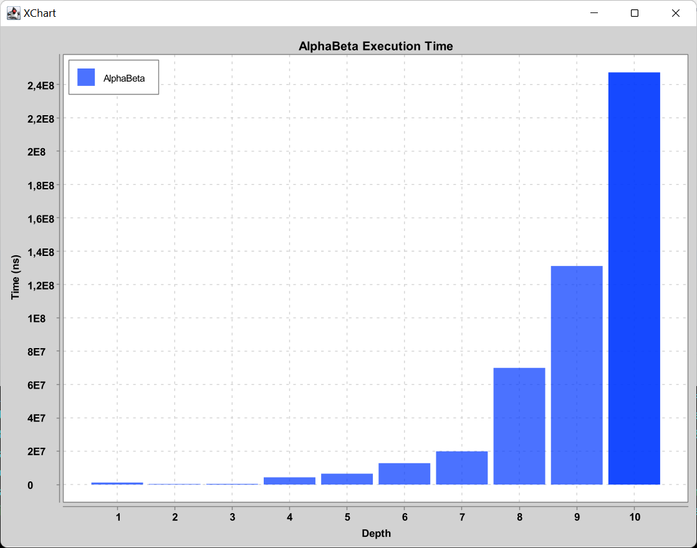

# Rapport de projet

## MLP

### Expérimentations et Résultats

Nous avons testé notre MLP sur les tables logiques ET, OU et XOR.
Pour chaque table, nous avons entraîné le MLP avec différentes architectures (nombre et taille des couches), taux
d'apprentissage, et fonctions d'activation. Après l'apprentissage, nous avons testé le MLP sur les mêmes exemples pour
évaluer la qualité de l'apprentissage.

Nous avons obtenu les résultats suivants :

| Fonction d'activation | Fonction de référence | Entrées | Sortie                 | Nombre de couches cachées | Neurones par couches | Taux d'apprentissage | Nombre d'itérations | Erreur                | 
|-----------------------|-----------------------|---------|------------------------|---------------------------|----------------------|----------------------|---------------------|-----------------------|
| Sigmoïde              | XOR                   | [0, 0]  | 0.4990304094544354     | 1                         | [2, 2, 1]            | 0.1                  | 10000               | 0.5049288004653214    |
| Sigmoïde              | XOR                   | [0, 1]  | 0.49862051347133257    | 1                         | [2, 2, 1]            | 0.1                  | 10000               | 0.5049288004653214    |
| Sigmoïde              | XOR                   | [1, 0]  | 0.5014561019638034     | 1                         | [2, 2, 1]            | 0.1                  | 10000               | 0.5049288004653214    |
| Sigmoïde              | XOR                   | [1, 1]  | 0.5010364792543377     | 1                         | [2, 2, 1]            | 0.1                  | 10000               | 0.5049288004653214    |
| Sigmoïde              | AND                   | [0, 0]  | 0.0010836773365809967  | 1                         | [2, 2, 1]            | 0.1                  | 10000               | 0.010369685026790254  |
| Sigmoïde              | AND                   | [0, 1]  | 0.004876677875313595   | 1                         | [2, 2, 1]            | 0.1                  | 10000               | 0.010369685026790254  |
| Sigmoïde              | AND                   | [1, 0]  | 0.00519661136199148    | 1                         | [2, 2, 1]            | 0.1                  | 10000               | 0.010369685026790254  |
| Sigmoïde              | AND                   | [1, 1]  | 0.9896525415632641     | 1                         | [2, 2, 1]            | 0.1                  | 10000               | 0.010369685026790254  |
| Sigmoïde              | OR                    | [0, 0]  | 0.012622832150459404   | 1                         | [2, 2, 1]            | 0.1                  | 10000               | 6.418540851227394E-5  |
| Sigmoïde              | OR                    | [0, 1]  | 0.9941833602402306     | 1                         | [2, 2, 1]            | 0.1                  | 10000               | 6.418540851227394E-5  |
| Sigmoïde              | OR                    | [1, 0]  | 0.9941764218149999     | 1                         | [2, 2, 1]            | 0.1                  | 10000               | 6.418540851227394E-5  |
| Sigmoïde              | OR                    | [1, 1]  | 0.9999358148399287     | 1                         | [2, 2, 1]            | 0.1                  | 10000               | 6.418540851227394E-5  |
| Hyperbolique          | XOR                   | [0, 0]  | 2.997975624305035E-4   | 1                         | [2, 2, 1]            | 0.1                  | 10000               | 3.312593982461541E-4  |
| Hyperbolique          | XOR                   | [0, 1]  | 0.9992990904283804     | 1                         | [2, 2, 1]            | 0.1                  | 10000               | 3.312593982461541E-4  |
| Hyperbolique          | XOR                   | [1, 0]  | 0.999298643504586      | 1                         | [2, 2, 1]            | 0.1                  | 10000               | 3.312593982461541E-4  |
| Hyperbolique          | XOR                   | [1, 1]  | -1.7091106263497963E-4 | 1                         | [2, 2, 1]            | 0.1                  | 10000               | 3.312593982461541E-4  |
| Hyperbolique          | AND                   | [0, 0]  | -4.360618617999602E-4  | 1                         | [2, 2, 1]            | 0.1                  | 10000               | 0.0012258503423522304 |
| Hyperbolique          | AND                   | [0, 1]  | 6.639352526885852E-5   | 1                         | [2, 2, 1]            | 0.1                  | 10000               | 0.0012258503423522304 |
| Hyperbolique          | AND                   | [1, 0]  | 3.743344742401563E-4   | 1                         | [2, 2, 1]            | 0.1                  | 10000               | 0.0012258503423522304 |
| Hyperbolique          | AND                   | [1, 1]  | 0.9987753961498149     | 1                         | [2, 2, 1]            | 0.1                  | 10000               | 0.0012258503423522304 |
| Hyperbolique          | OR                    | [0, 0]  | 9.969417318368007E-5   | 1                         | [2, 2, 1]            | 0.1                  | 10000               | 6.194223343714E-5     |
| Hyperbolique          | OR                    | [0, 1]  | 0.9998110420103413     | 1                         | [2, 2, 1]            | 0.1                  | 10000               | 6.194223343714E-5     |
| Hyperbolique          | OR                    | [1, 0]  | 0.9998025903103174     | 1                         | [2, 2, 1]            | 0.1                  | 10000               | 6.194223343714E-5     |
| Hyperbolique          | OR                    | [1, 1]  | 0.9999380587842318     | 1                         | [2, 2, 1]            | 0.1                  | 10000               | 6.194223343714E-5     |

Cela signifie que :

- Avec la fonction d'activation sigmoïde, le MLP a pu apprendre parfaitement les tables ET et OU, mais a eu du mal avec
  la table XOR. Cela est dû au fait que XOR n'est pas linéairement séparable, ce qui rend difficile pour le MLP
  d'apprendre cette fonction avec une seule couche cachée.
- Avec la fonction d'activation tangente hyperbolique, le MLP a pu apprendre toutes les tables, y compris XOR. Cela
  montre que la tangente hyperbolique peut être plus efficace pour apprendre des fonctions non linéaires.
- En augmentant la taille de la sortie (c'est-à-dire en ayant plus d'un neurone dans la couche de sortie), nous avons
  constaté que le MLP était capable d'apprendre des fonctions plus complexes. Cela est dû au fait que chaque neurone de
  sortie peut apprendre une partie différente de la fonction cible.
- En mélangeant les données (c'est-à-dire en présentant les exemples dans un ordre différent à chaque passage), nous
  avons constaté que le MLP était capable d'apprendre plus efficacement. Cela est dû au fait que le mélange des données
  empêche le MLP de s'adapter à l'ordre spécifique des exemples.

## Défi 3 : Amélioration de MinMax

### Réduire la taille de l'espace de recherche

#### Estimer le nombre d'états du puissance-4 et le facteur de branchement.

Le Puissance 4 se joue sur une grille de 6 rangées et 7 colonnes, ce qui donne un total de 42 emplacements possibles pour les pions.
Chaque emplacement peut être dans l'un des trois états suivants : vide, occupé par un pion du joueur 1, occupé par un pion du joueur 2. 
Cela donne un total de $3^42$ états possibles. 
Ce nombre inclut des états non valides, où des pions flottent dans l'air sans aucun pion en dessous d'eux.
Pour trouver le nombre d'états valides, il faudrait explorer toutes les possibilités, ce qui est pratiquement impossible à cause du grand nombre d'états.

Chaque colonne peut accepter un pion, à condition qu'elle ne soit pas déjà pleine. 
Au début du jeu, il y a 7 mouvements possibles et, au fur et à mesure que les colonnes se remplissent, le nombre de mouvements possibles diminue. 
Même si cela varie en fonction de l'état spécifique du jeu, on peut donc estimer le facteur de branchement à 7/2 = 3,5.

<br>

#### Coder l’algorithme Alpha-Beta

Voir `Game.java` et `MinMaxAlphaBetaPlayer.java`.

<br>

#### Tester Alpha-Beta sur le morpion. <br>En comptant le nombre d'états considérés, vérifier qu'il permet d’effectivement réduire ce nombre par rapport à MinMax. <br>Le tester sur le puissance-4 ...

Voici un exemple d'une partie déjà commencée au morpion :
```
  1 | 2 | 3
-------------
  4 | X | 6
-------------
  7 | 8 | O
```

C'est maintenant au tour du joueur 1 (X).

Avec l'algorithme MinMax, il faut envisager tous les mouvements possibles pour le joueur 1, c'est-à-dire les positions 1, 2, 3, 4, 6, 7 et 8. 
Pour chaque mouvement, nous devons ensuite envisager tous les mouvements possibles pour le joueur 2 (O), et ainsi de suite jusqu'à la fin du jeu. Cela peut entraîner un grand nombre d'états à considérer.

Avec l'algorithme Alpha-Beta, nous commençons de la même manière en envisageant le premier mouvement possible pour le joueur 1. 
En choisissant le mouvement 1 en premier, le joueur 1 envisage ensuite le meilleur mouvement possible pour le joueur 2 en réponse à ce mouvement. 
S'il s'agit du mouvement 2 pour le joueur 2 et que ce mouvement donne un meilleur résultat pour le joueur 2 que le meilleur résultat trouvé jusqu'à présent pour le joueur 1, alors nous pouvons arrêter de considérer les autres mouvements pour le joueur 1 après le mouvement 1. 
En effet, le joueur 1 ne choisirait pas le mouvement 1 s'il sait que le joueur 2 peut répondre avec le mouvement 2. 
Cela permet d'éliminer une grande partie de l'arbre de jeu sans avoir à l'explorer entièrement. 

C'est ainsi que l'algorithme Alpha-Beta permet de réduire le nombre d'états considérés par rapport à l'algorithme MinMax.

En revanche, cela ne fonctionne toujours pas pour le Puissance 4.


### Cela ne suffit visiblement pas

#### Identifier pour le puissance-4 quel sont les structures qui influent sur les chances de gagner.

Plusieurs structures peuvent influencer les chances de gagner :
- Alignements : Les alignements de jetons sont la clé pour gagner. Un joueur qui a trois jetons alignés a plus de chances de gagner qu'un joueur qui a seulement deux jetons alignés, car il n'a besoin que d'un jeton supplémentaire pour gagner. De même, un joueur qui a deux jetons alignés a plus de chances de gagner qu'un joueur qui a seulement un jeton.
- Bloquer les alignements adverses : Bloquer un alignement de trois jetons adverses peut améliorer considérablement les chances de gagner, car cela empêche l'adversaire de gagner au tour suivant.
- Contrôle du centre : Le contrôle des colonnes du milieu du plateau est souvent crucial au Puissance 4, car cela offre plus d'opportunités pour créer des alignements dans différentes directions.
- Créer des menaces multiples : Créer des situations où un joueur a plusieurs façons de gagner (par exemple, deux alignements de trois jetons qui ne peuvent pas être bloqués tous les deux en un seul tour) peut augmenter considérablement les chances de gagner.

<br>

#### En faisant des recherches, trouver des exemples de fonctions d'évaluations et proposer une fonction pour le jeux.

Voir `Game.java`.

#### Modifier Alpha-Beta pour fixer une profondeur maximum. Une fois la profondeur atteinte la valeur retournée sera celle de la fonction d'évaluation.

Voir `Game.java` et `MinMaxAlphaBetaPlayer.java`.

<br>

#### En calculant le temps nécessaire pour un joueur alpha-beta de prendre une décision, faire un graphique de ce temps en fonction de la profondeur fixée.

A partir de notre classe `AlphaBetaBenchmark.java` et du main `MeasureAlphaBeta.java`, nous obtenons les résultats suivants :



On peut voir que le temps de calcul augmente exponentiellement avec la profondeur. 
Cela est dû au fait que le nombre d'états à considérer augmente exponentiellement.
